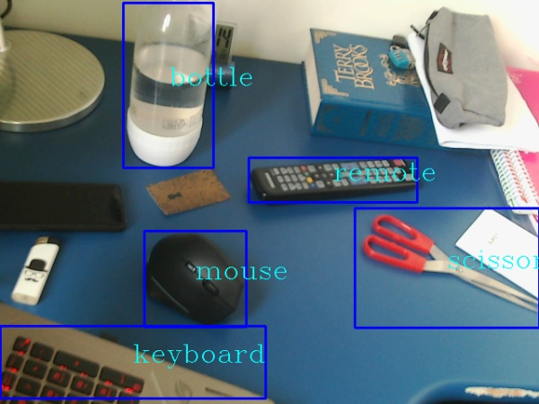
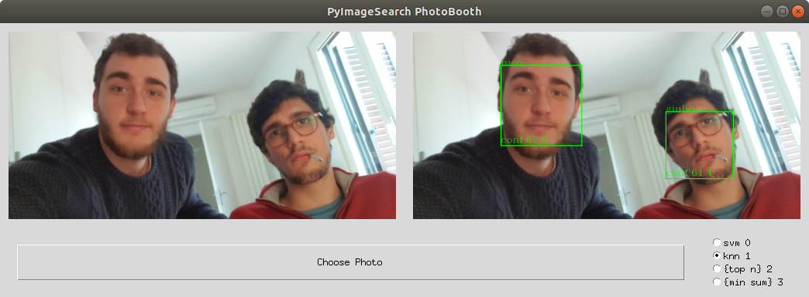
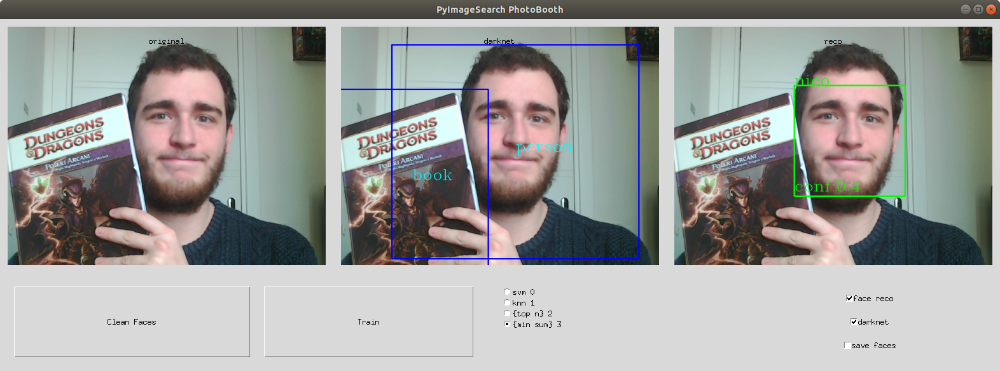
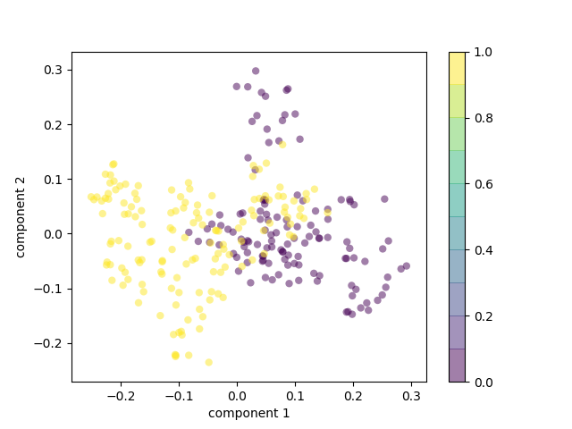
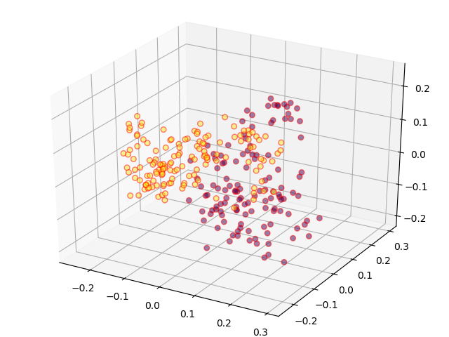

# MotionBot

This branch brings the concept of smart surveillance system beyond its original scope. 
The famous [Darknet](https://pjreddie.com/darknet/) framework has been successfully integrated, making the object recognition 
task fast and secure.\
More over the face recognition task has been improved using the
 [face recognition repo](https://github.com/ageitgey/face_recognition).

## Installation
in this section the setup for this branch is explained.\
You **must** perform the setup of the master branch first in order to make this work.


### Python 
Install the requirements using\
`pip install -r requirements.txt`\
So that the additional packages will be installed.

### Darknet Setup
For the darknet installation refer to the following links:
- Follow the instructions in the [darknet](https://pjreddie.com/darknet/install/) to compile the darknet environment
- Run [setup.sh](./setup.sh) in the main directory to perform the setup


## Usage

There are various python files which can be executed.

### Main 

To start the secure system first position your camera where you want and then use the [main.py](./src/main.py) file:\
`python ./src/main.py`\

If everything worked fine you should see the following messages:
```
TOKEN : your token
Password : 12345678
getting ids from file
...
Darknet metadata loading
...
camera connected
Polling...
Reset ground image ...
Done
```
If not look at the [Journal](./Journals/Journal_Darknet.md) to check for possible solutions to your problem.

### Tests
There are multiple kind of test executables in the [Test](./src/Tests) directory.

#### Darknet 

[This file](./src/Tests/darknet_test.py) works uniquely with the darknet framework showing how it works in real time. You can also take screenshots of what 
the program is seeing (notice that a webcam must be connected in order to make it work), as shown in the following image.


#### Photo recognizer
[This file](./src/Tests/photo_recognizer_test.py) is used to test the recognizer with static images. It supports the loading of a custom 
image from the device and the choosing of multiple types of algorithm for face recognition 
(see the [Classification algorithms section](#classification_alg) for more information on the algorithms).



#### Video recognizer
[This file](./src/Tests/video_recognizer_test.py) does the same as the previous two but on videos. It allows to segment the 
video feed from the webcam with both the face recognizer and darknet. Notice that the activation of both will slow down the cam FPS.

Moreover there are some additional functionality:
- The *save faces* checkbox is used to save detected faces in the [Unkown](./Faces/Unknown) directory in order to gain 
samples faster than using the surveillance system.
- The *clean face* button is used to filter those images in the [Unkown](./Faces/Unknown) directory which have a similarity higher than a 
certain threshold
- The *Train* button trains the model on new images in the [Faces](./Faces) directory. 


## <a name="classification_alg"></a> Classification algorithms
The classification algoritmhs are chosen using the *clf_flag* in the [Face recognizer](./src/Classes/Face_recognizer.py) file. 
Each integers maps to a different method:
- 0 -> SVM
- 1 -> KNN
- 2 -> Distance : top n
- 3 -> Distance : minimum sum 

### Dataset
The dataset is made of the face embeddings and an associated list of the people they belongs to. These embeddings, called *encodings* 
in the [face recognition repo](https://github.com/ageitgey/face_recognition) , are arrays of 128 floats. They can be seen as 
"summaries" extracted from a person's face ([here](https://medium.com/@ageitgey/machine-learning-is-fun-part-4-modern-face-recognition-with-deep-learning-c3cffc121d78)
are more information about how the embeddings extraction works).\
Using PCA on the a dataset made of two individuals with 124 and 144 embeddings respectively yelds the following plots:

2d plot           |  3d plot
:-------------------------:|:-------------------------:
  | 


### SVM
This classifier is the easiest classificator since it fits the 