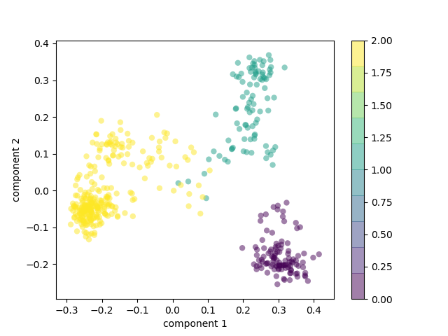
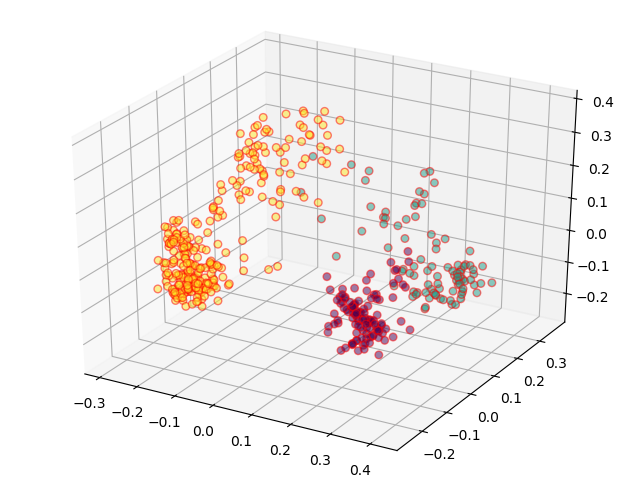

# Face Recognizer
In this section the functionalities of the
[face recognizer](Readme/face_recognizer.md) will be explained in
details, images and example will be provided

## Introduction 

The Face recognizer class has two main purpose:
- The handle of the classification menu in telegram
- The recognition of faces, through model training and prediction 

## Telegram 

The classification menu can be invoked on telegram with the use of the
*/classify* command. This menu allows the user to do multiple things
depending on the button pressed as can be seen from the following image.

- *Filter Faces*: if the number of faces in the *Unk* dir is high, use
  this button to filter the faces which have a high similarity to each
  other.
- *Save Faces*: triggers the saving of the faces in the *Unk* dir
  depending on the user choice (more later).
- *Exit* : trigger the treaining of the model and the elimnation of the
  images classified previously

### Saving Faces

The save face menu is shown in the following image:

## Face Recognition

As previously mentioned, the recognition framework used in this project
is the one coming from
[this repo](https://github.com/ageitgey/face_recognition). It is used
both for face detection as well as a base for face recognition system.\

The 

###  Classification algorithms
The classification algorithms are chosen using the *clf_flag* in the [Face recognizer](./src/Classes/Face_recognizer.py) file. 
Each integers maps to a different method:
- 0 -> SVM
- 1 -> KNN
- 2 -> Distance : top n
- 3 -> Distance : minimum sum 

### Dataset
The dataset is made of the face embeddings and an associated list of the people they belongs to. These embeddings, called *encodings* 
in the [face recognition repo](https://github.com/ageitgey/face_recognition) , are arrays of 128 floats. They can be seen as 
"summaries" extracted from a person's face ([here](https://medium.com/@ageitgey/machine-learning-is-fun-part-4-modern-face-recognition-with-deep-learning-c3cffc121d78)
are more information about how the embeddings extraction works).\
Using PCA on the a dataset made of two individuals with 124 and 144 embeddings respectively yelds the following plots:

2d plot           |  3d plot
:-------------------------:|:-------------------------:
  | 

Moreover the variance per componetns can be plotted too, which will be
useful for the KNN algorithm 

### SVM
This is the easiest classificator since it fits the dataset and then performs a prediction based on what it has learned.
No additional configuration is needed, but some tuning may increase its accuracy. Moreover the [SVC](https://scikit-learn.org/stable/modules/generated/sklearn.svm.SVC.html)
does not provide a measure of probability for its decision, hence the confidence in the prediction is set to a constant "-".
 
### KNN
This is the approach used by *ageitgey* in its [example code](https://github.com/ageitgey/face_recognition/blob/master/examples/face_recognition_knn.py) where
a k-nearest-neighbors classifier is used. Parameters such as the number of neighbors can be tweaked directly in the *predict* function.

### Distance 
This category of custom algorithm make use of the [face distance](https://github.com/ageitgey/face_recognition/blob/master/face_recognition/api.py#L60)
function which returns an array of distances given the train set and a new face encoding.\
A *normalized distance vector*, which is the distance vector normalized so that its elements sums up to 1, is used in 
the following computations.

#### Top n
The *top n* algorithm implement a voting system based on taking the top *n* closest distances to the one to predict. 
Then it counts the number of times each label appears in the vector of lenght *n* and return the most common one.

#### Lowest Sum
This algorithm uses the normalized distance vector to sum all the distances belonging to a specific label and then 
normalize them with the number of times that labels appears in the dataset. It then return the label with the lowest 
value.